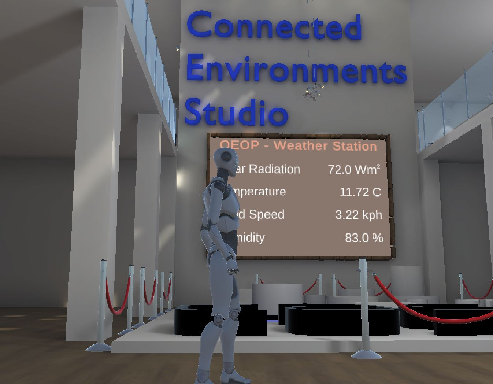

# Unity Foundation 2 - Connected Environments Studio

## The complete example of Sensor Data Visualisation - Lecture 1 and 2

### How to open the project

The folder `Week1_Gallery` contains the entire Unity project (version used 2020.3.9f1)

### Features

- Mqtt Real Time Data using JSON (`mqttReceiver.cs` and `mqttController.cs` with [M2MQTT Library](https://github.com/CE-SDV-Unity/M2MqttUnity));
- Mqtt Real Time Data using list of topics and single value `mqttReceiverList.cs` and `mqttControllerList.cs` with [M2MQTT Library](https://github.com/CE-SDV-Unity/M2MqttUnity));
- RealTime API JSON (`museumAPI.cs`);
- Lightmap settings

### Digital Models used

- [Low Poly Plant in a pot](https://skfb.ly/o6u8M) by eucalyp555 is licensed under [Creative Commons Attribution](http://creativecommons.org/licenses/by/4.0/);
- [Stone Ancient Window / Door Frame (PBR)](https://skfb.ly/6RJLx) by brainchildpl is licensed under [Creative Commons Attribution](http://creativecommons.org/licenses/by/4.0/);
- [Desert Nomad Windmill](https://skfb.ly/oqMKO) by BenVanhaelst is licensed under [Creative Commons Attribution](http://creativecommons.org/licenses/by/4.0/).

Part of the Sensor Data Visualisation Module 

Dr. Valerio Signorelli
Prof. Andy Hudson-Smith
